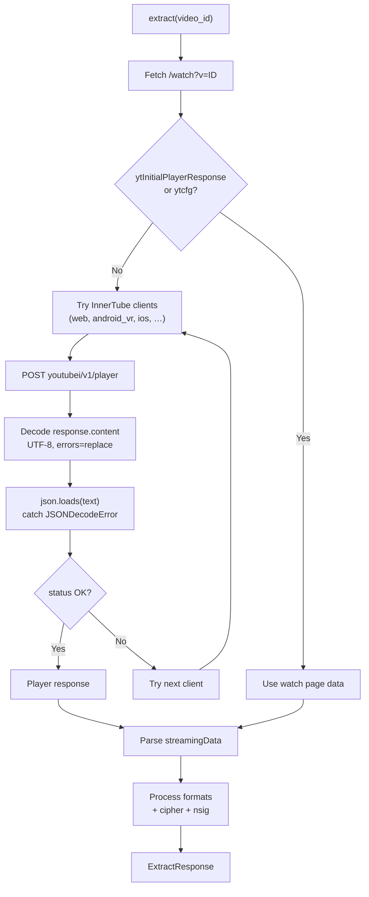
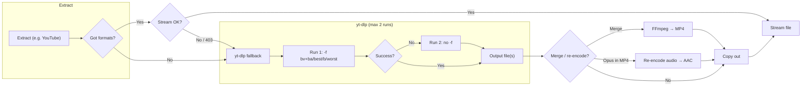

# Changelog

All notable changes to the Media Fetch API are documented here.

---

## 2026-02-07

### YouTube extraction and download

- **InnerTube response handling**  
  InnerTube API responses are now decoded and parsed in a robust way:
  - Response body is decoded as UTF-8 with `errors="replace"` so invalid bytes do not raise; then parsed as JSON with explicit error handling.
  - Avoids `'utf-8' codec can't decode byte ...` and `Expecting value: line 1 column 1` from breaking the built-in extractor when YouTube returns odd encoding or empty bodies.
  - On any InnerTube/watch-page failure, the download flow still falls back to yt-dlp so downloads can succeed.

- **Download format waterfall (5 levels, 2 runs)**  
  Server-side download (`GET /api/download`) keeps a 5-level format fallback but uses at most **two** yt-dlp runs instead of five:
  - **Run 1**: Single format string `bestvideo+bestaudio/best/best/b/worst` so yt-dlp tries merge → best → b → worst in one process.
  - **Run 2**: If the first run fails with “Requested format is not available” or “Sign in to confirm you're not a bot”, retry with no `-f` (yt-dlp default).
  - Result: same “download in any case” behavior with fewer subprocess runs and less overhead.

---

### YouTube extract flow (with InnerTube decode)

---

### Server-side download flow (format waterfall)

---

### Summary

| Area        | Change |
|------------|--------|
| **YouTube** | InnerTube response: decode UTF-8 with `errors="replace"`, then `json.loads` with try/except so invalid or empty bodies don’t crash the extractor. |
| **Download** | 5-level format waterfall (merge → best → b → worst → no -f) in at most 2 yt-dlp runs; retry once on “Sign in to confirm”. |
