# Media Fetch API

A self-contained Python FastAPI server that extracts direct media URLs from **12 major platforms**. The API accepts a URL, identifies the platform, runs the appropriate extractor and returns direct media URLs with full format metadata.

---

## Table of Contents

- [Architecture Overview](#architecture-overview)
- [Supported Platforms](#supported-platforms)
- [Quick Start](#quick-start)
- [API Reference](#api-reference)
- [Request Flow](#request-flow)
- [Extractor Details](#extractor-details)
- [Format Selection](#format-selection)
- [Cookie Authentication](#cookie-authentication)
- [Configuration](#configuration)
- [Project Structure](#project-structure)
- [Deployment](#deployment)
- [Development](#development)
- [Troubleshooting](#troubleshooting)
- [Attribution](#attribution)

---

## Architecture Overview

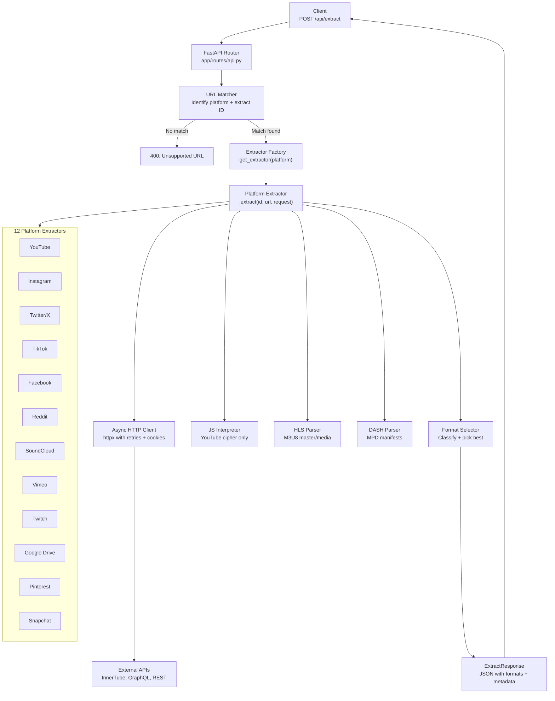

### Component Interaction

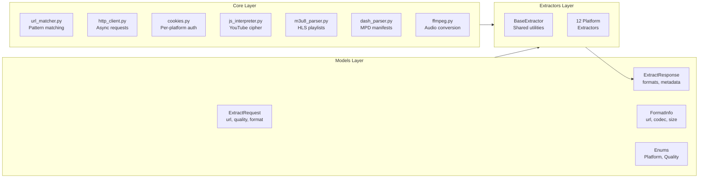

---

## Supported Platforms

| Platform | Domains Handled | Content Types | Authentication | Extraction Method |
|----------|----------------|---------------|----------------|-------------------|
| **YouTube** | `youtube.com`, `youtu.be`, `music.youtube.com` | Videos, Shorts, Live, Music | Optional cookies | InnerTube API (5 client configs) |
| **Instagram** | `instagram.com` | Posts, Reels, Stories, Carousels | Optional cookies | GraphQL API + embed fallback |
| **Twitter/X** | `twitter.com`, `x.com`, `vxtwitter.com` | Videos, GIFs, Photos | Auto guest token | GraphQL + syndication fallback |
| **TikTok** | `tiktok.com`, `vm.tiktok.com`, `vt.tiktok.com` | Videos, Slideshows, Audio | None | Webpage `__UNIVERSAL_DATA__` |
| **Facebook** | `facebook.com`, `fb.watch` | Videos, Reels, Watch | Optional cookies | HTML parsing for HD/SD URLs |
| **Reddit** | `reddit.com`, `v.redd.it`, `redd.it` | Videos, GIFs, Galleries | Auto OAuth | JSON API, separate video+audio |
| **SoundCloud** | `soundcloud.com`, `on.soundcloud.com` | Tracks | None | API v2 + client ID extraction |
| **Vimeo** | `vimeo.com`, `player.vimeo.com` | Videos | Auto OAuth | API v3 + HLS |
| **Twitch** | `twitch.tv`, `clips.twitch.tv` | Clips, VODs | None | GraphQL + access tokens |
| **Google Drive** | `drive.google.com`, `docs.google.com` | Videos, Audio only | Optional cookies | Playback API + direct download |
| **Pinterest** | `pinterest.com`, `pin.it` | Pin videos, Images | None | Resource API |
| **Snapchat** | `snapchat.com`, `story.snapchat.com` | Spotlight, Stories | None | Next.js `__NEXT_DATA__` |

### URL Alias Resolution

Short links and alternate domains are automatically resolved before matching:

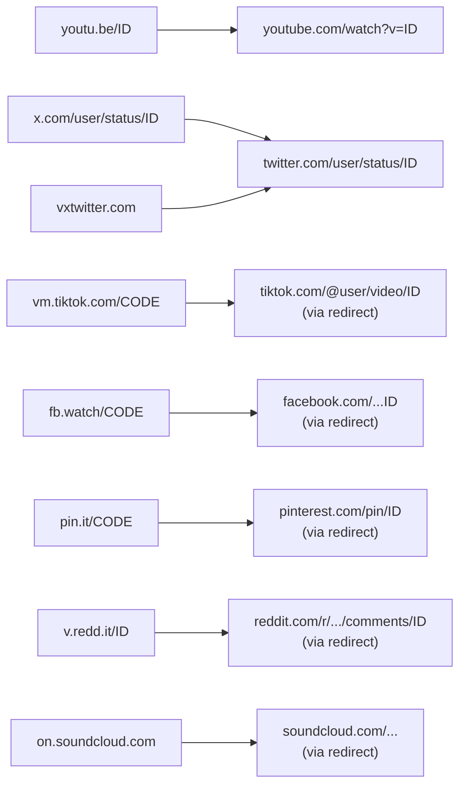

---

## Quick Start

### Option 1 -- Development (venv)

```bash
# Clone / navigate to the project
cd media-fetch-api

# Create and activate virtual environment
python3 -m venv venv
source venv/bin/activate        # Linux / macOS
# venv\Scripts\activate         # Windows

# Install dependencies
pip install ".[dev]"

# Make sure FFmpeg is installed on your system
# Ubuntu/Debian:  sudo apt install ffmpeg
# macOS:          brew install ffmpeg
# Arch:           sudo pacman -S ffmpeg

# Copy the example environment file
cp .env.example .env

# Start the server (with hot-reload)
uvicorn app.main:app --reload --port 8000
```

### Option 2 -- Docker

```bash
# Build and run with docker compose
docker compose up -d

# Or build and run manually
docker build -t media-fetch-api .
docker run -d -p 8000:8000 -v ./cookies:/app/cookies media-fetch-api
```

### Option 3 -- Development with tmux + ngrok

Run the API and expose it via ngrok in a split tmux session (API on port 7652):

```bash
tmux new-session -d -s media-api 'cd /home/sohamg_sarvam_ai/video-downloader/media-fetch-api && source venv/bin/activate && python -m uvicorn app.main:app --host 0.0.0.0 --port 7652'; tmux split-window -h -t media-api 'ngrok http 7652'; tmux attach -t media-api
```

Adjust the `cd` path if your project lives elsewhere. Detach with `Ctrl+b d`; reattach with `tmux attach -t media-api`.

### Verify

```bash
# Root info
curl http://localhost:8000/

# Health check (shows FFmpeg status and loaded cookies)
curl http://localhost:8000/api/health

# Interactive API docs
open http://localhost:8000/docs
```

### Downloading media (script)

Use **`./download.sh`** from the API project root (or **`./scripts/download.sh`** with the same args).

- **3 args** – Single-call **`GET /api/download?url=...`**: server does extract, then stream or **yt-dlp on the server** (with the API’s cookies). Best quality when the server has yt-dlp and valid `cookies/youtube.txt`.
  ```bash
  ./download.sh "https://your-api.ngrok-free.dev" "https://www.youtube.com/watch?v=VIDEO_ID" output.mp4
  ```

**Server**: Install **yt-dlp** on the API server (e.g. `pip install yt-dlp` or use the Docker image which includes it). Put **cookies** in `cookies/youtube.txt` on the server for better YouTube quality. See [scripts/COOKIES.md](scripts/COOKIES.md).

---

## API Reference

### Endpoints

| Method | Path | Description |
|--------|------|-------------|
| `POST` | `/api/extract` | Extract media URLs from a supported platform |
| `GET` | `/api/download` | Download media file in one call (server runs yt-dlp when needed) |
| `GET` | `/api/supported` | List all supported platforms with example URLs |
| `GET` | `/api/health` | Health check: FFmpeg availability, cookie status |
| `GET` | `/docs` | Swagger UI (auto-generated) |
| `GET` | `/redoc` | ReDoc (auto-generated) |

### `POST /api/extract`

#### Request Body

```json
{
  "url": "https://www.youtube.com/watch?v=dQw4w9WgXcQ",
  "media_type": "both",
  "quality": "best",
  "audio_format": "best",
  "video_format": "best",
  "include_metadata": true,
  "include_subtitles": false,
  "subtitle_lang": null,
  "cookie_file": null,
  "password": null
}
```

#### Request Parameters

| Parameter | Type | Default | Allowed Values | Description |
|-----------|------|---------|----------------|-------------|
| `url` | `string` | **required** | Any supported URL | The media URL to extract |
| `media_type` | `string` | `"both"` | `"video"`, `"audio"`, `"both"` | Filter returned formats by type |
| `quality` | `string` | `"best"` | `"best"`, `"worst"`, `"4320"`, `"2160"`, `"1440"`, `"1080"`, `"720"`, `"480"`, `"360"`, `"240"`, `"144"` | Preferred video resolution |
| `audio_format` | `string` | `"best"` | `"best"`, `"mp3"`, `"flac"`, `"wav"`, `"ogg"` | Preferred audio format |
| `video_format` | `string` | `"best"` | `"best"`, `"mp4"`, `"mkv"`, `"webm"`, `"mov"` | Preferred video container |
| `include_metadata` | `bool` | `true` | `true`, `false` | Include uploader, views, description, etc. |
| `include_subtitles` | `bool` | `false` | `true`, `false` | Include available subtitle tracks |
| `subtitle_lang` | `string` | `null` | ISO 639-1 code (`"en"`, `"es"`, ...) | Preferred subtitle language |
| `cookie_file` | `string` | `null` | Platform name (`"youtube"`, `"instagram"`, ...) | Load cookies from `cookies/<name>.txt` |
| `password` | `string` | `null` | Any string | Password for protected content (Vimeo) |

#### Success Response (`200`)

```json
{
  "success": true,
  "platform": "youtube",
  "id": "dQw4w9WgXcQ",
  "title": "Rick Astley - Never Gonna Give You Up (Official Video)",
  "duration": 213.0,
  "thumbnail": "https://i.ytimg.com/vi/dQw4w9WgXcQ/maxresdefault.jpg",
  "formats": [
    {
      "url": "https://rr3---sn-xxx.googlevideo.com/videoplayback?...",
      "format_id": "137",
      "ext": "mp4",
      "width": 1920,
      "height": 1080,
      "fps": 30.0,
      "vcodec": "avc1.640028",
      "acodec": "none",
      "abr": null,
      "vbr": null,
      "tbr": 4000.0,
      "filesize": 52428800,
      "filesize_approx": null,
      "format_type": "video_only",
      "quality_label": "1080p",
      "protocol": "https",
      "http_headers": null,
      "fragment_base_url": null,
      "fragments": null
    },
    {
      "url": "https://rr3---sn-xxx.googlevideo.com/videoplayback?...",
      "format_id": "251",
      "ext": "webm",
      "width": null,
      "height": null,
      "fps": null,
      "vcodec": "none",
      "acodec": "mp4a.40.2",
      "abr": 160.0,
      "vbr": null,
      "tbr": 160.0,
      "filesize": 3456789,
      "filesize_approx": null,
      "format_type": "audio_only",
      "quality_label": null,
      "protocol": "https",
      "http_headers": null,
      "fragment_base_url": null,
      "fragments": null
    }
  ],
  "best_video": { "...FormatInfo..." },
  "best_audio": { "...FormatInfo..." },
  "best_combined": { "...FormatInfo..." },
  "subtitles": {
    "en": [
      {
        "url": "https://www.youtube.com/api/timedtext?...",
        "lang": "en",
        "lang_name": "English",
        "ext": "vtt",
        "is_auto_generated": false
      }
    ]
  },
  "metadata": {
    "uploader": "Rick Astley",
    "uploader_id": "UCuAXFkgsw1L7xaCfnd5JJOw",
    "uploader_url": "https://www.youtube.com/channel/UCuAXFkgsw1L7xaCfnd5JJOw",
    "upload_date": "2009-10-25",
    "description": "The official video for ...",
    "view_count": 1500000000,
    "like_count": null,
    "comment_count": null,
    "repost_count": null,
    "tags": ["rick astley", "never gonna give you up", "..."],
    "categories": null,
    "is_live": false,
    "was_live": null,
    "age_restricted": false
  }
}
```

#### Error Response (`400` / `500`)

```json
{
  "detail": {
    "success": false,
    "error": "Unsupported URL or platform: https://example.com/video",
    "error_code": "url.unsupported",
    "platform": null
  }
}
```

#### Error Codes

| Code | Meaning |
|------|---------|
| `url.unsupported` | URL does not match any supported platform |
| `extractor.unavailable` | Platform extractor could not be loaded |
| `extraction.failed` | Generic extraction failure |
| `youtube.playability_error` | YouTube returned an error (private, age-restricted, etc.) |
| `instagram.extraction_failed` | All Instagram API methods failed |
| `instagram.cookies_required` | Stories require cookie authentication |
| `twitter.extraction_failed` | Tweet data could not be fetched |
| `twitter.no_media` | Tweet exists but contains no downloadable media |
| `tiktok.extraction_failed` | TikTok video data could not be parsed |
| `facebook.no_video` | No video URLs found in Facebook page |
| `reddit.no_media` | Post is text-only, a link, or a static image |
| `soundcloud.no_client_id` | Could not extract SoundCloud client ID from JS |
| `vimeo.forbidden` | Video is private or password-protected |
| `twitch.clip_not_found` | Clip slug does not exist |
| `google_drive.not_media` | File is not a video or audio file |
| `pinterest.not_found` | Pin does not exist |
| `snapchat.no_video` | No video found on Snapchat page |

### Usage Examples

```bash
# YouTube -- all formats
curl -s -X POST http://localhost:8000/api/extract \
  -H "Content-Type: application/json" \
  -d '{"url": "https://www.youtube.com/watch?v=dQw4w9WgXcQ"}' | jq .

# YouTube -- audio only, prefer mp3
curl -s -X POST http://localhost:8000/api/extract \
  -H "Content-Type: application/json" \
  -d '{
    "url": "https://youtu.be/dQw4w9WgXcQ",
    "media_type": "audio",
    "audio_format": "mp3"
  }' | jq '.best_audio'

# YouTube -- 720p with subtitles
curl -s -X POST http://localhost:8000/api/extract \
  -H "Content-Type: application/json" \
  -d '{
    "url": "https://www.youtube.com/watch?v=dQw4w9WgXcQ",
    "quality": "720",
    "include_subtitles": true,
    "subtitle_lang": "en"
  }' | jq '{best_video, best_audio, subtitles}'

# Instagram reel
curl -s -X POST http://localhost:8000/api/extract \
  -H "Content-Type: application/json" \
  -d '{"url": "https://www.instagram.com/reel/EXAMPLE/"}' | jq .

# Twitter/X video
curl -s -X POST http://localhost:8000/api/extract \
  -H "Content-Type: application/json" \
  -d '{"url": "https://x.com/user/status/123456789"}' | jq .

# TikTok (short link)
curl -s -X POST http://localhost:8000/api/extract \
  -H "Content-Type: application/json" \
  -d '{"url": "https://vm.tiktok.com/EXAMPLE/"}' | jq .

# Reddit video
curl -s -X POST http://localhost:8000/api/extract \
  -H "Content-Type: application/json" \
  -d '{"url": "https://www.reddit.com/r/funny/comments/abc123/title/"}' | jq .

# SoundCloud track
curl -s -X POST http://localhost:8000/api/extract \
  -H "Content-Type: application/json" \
  -d '{"url": "https://soundcloud.com/artist/track-name"}' | jq .

# Vimeo (password-protected)
curl -s -X POST http://localhost:8000/api/extract \
  -H "Content-Type: application/json" \
  -d '{
    "url": "https://vimeo.com/123456789",
    "password": "secret123"
  }' | jq .

# Twitch clip
curl -s -X POST http://localhost:8000/api/extract \
  -H "Content-Type: application/json" \
  -d '{"url": "https://clips.twitch.tv/FunnyClipSlug"}' | jq .

# Google Drive (video files only)
curl -s -X POST http://localhost:8000/api/extract \
  -H "Content-Type: application/json" \
  -d '{"url": "https://drive.google.com/file/d/FILE_ID/view"}' | jq .

# Pinterest pin
curl -s -X POST http://localhost:8000/api/extract \
  -H "Content-Type: application/json" \
  -d '{"url": "https://www.pinterest.com/pin/123456789/"}' | jq .

# Snapchat Spotlight
curl -s -X POST http://localhost:8000/api/extract \
  -H "Content-Type: application/json" \
  -d '{"url": "https://www.snapchat.com/spotlight/EXAMPLE"}' | jq .
```

---

## Request Flow

The following diagram traces the full lifecycle of a single `POST /api/extract` request, from receiving the URL to returning the response:

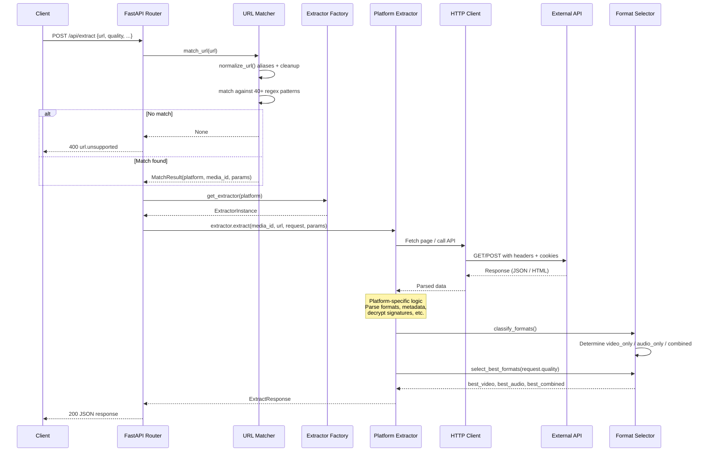

### YouTube-Specific Flow

YouTube is the most complex extractor. This diagram shows its internal logic:

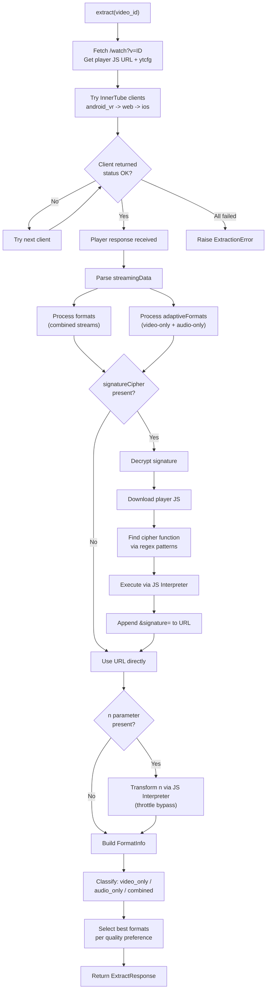

---

## Extractor Details

### How Each Extractor Works

Each extractor inherits from `BaseExtractor` and implements `_extract()`. The base class provides shared utilities for HTTP requests, JSON extraction, regex search, cookie management and format classification.

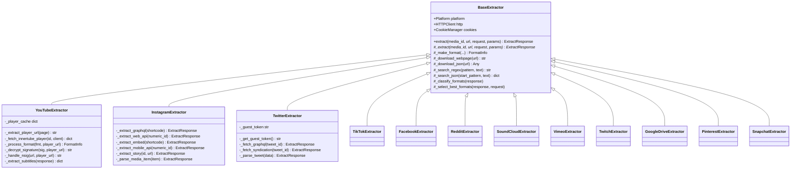

### Per-Platform API Strategy

| Platform | Primary Method | Fallback 1 | Fallback 2 | Fallback 3 |
|----------|---------------|------------|------------|------------|
| YouTube | InnerTube `android_vr` | InnerTube `web` | InnerTube `ios` | Watch page scraping |
| Instagram | Web API `/media/{id}/info/` | GraphQL API | Embed page parsing | Mobile API (bearer) |
| Twitter/X | GraphQL `TweetResultByRestId` | Syndication API | -- | -- |
| TikTok | Webpage `__UNIVERSAL_DATA__` | Embed API | -- | -- |
| Facebook | HTML parsing (HD/SD URLs) | Relay/GraphQL data | -- | -- |
| Reddit | JSON API (`.json` suffix) | OAuth API | -- | -- |
| SoundCloud | Resolve API + transcodings | -- | -- | -- |
| Vimeo | API v3 with OAuth bearer | HLS master playlist | -- | -- |
| Twitch | GraphQL (clips) | HLS via Usher (VODs) | -- | -- |
| Google Drive | Workspace Playback API | Direct download URL | -- | -- |
| Pinterest | Resource API | HTML regex parsing | -- | -- |
| Snapchat | `__NEXT_DATA__` extraction | `<link preload>` tag | -- | -- |

---

## Format Selection

When a response contains multiple formats, the API automatically classifies each one and picks the best match for the requested quality.

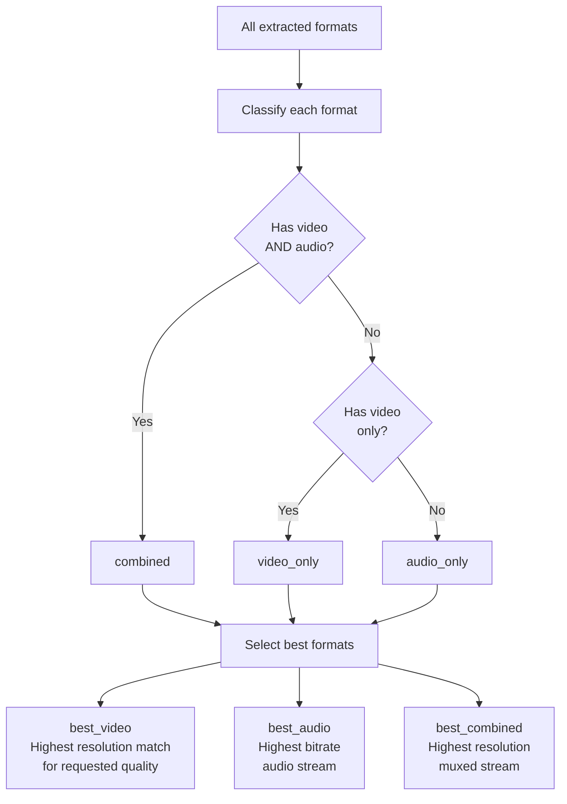

### Quality Matching Logic

- `"best"` -- Highest available resolution / bitrate
- `"worst"` -- Lowest available resolution / bitrate
- `"1080"`, `"720"`, etc. -- Closest resolution to the target (prefers exact, then nearest)

### Format Type Definitions

| `format_type` | `vcodec` | `acodec` | Description |
|---------------|----------|----------|-------------|
| `combined` | present | present | Muxed video+audio in one stream (e.g., YouTube itag 18) |
| `video_only` | present | `"none"` | Adaptive video, no audio (e.g., YouTube itag 137) |
| `audio_only` | `"none"` | present | Adaptive audio, no video (e.g., YouTube itag 251) |

> **Note on Reddit**: Reddit serves video and audio as separate streams. The response will contain `video_only` and `audio_only` format entries. To get a combined file, the client should download both and merge them with FFmpeg: `ffmpeg -i video.mp4 -i audio.mp4 -c copy output.mp4`

---

## Cookie Authentication

Some platforms require or benefit from cookie-based authentication:

| Platform | Why Cookies Help |
|----------|-----------------|
| YouTube | Age-restricted, members-only, or premium content |
| Instagram | Stories, private accounts, higher quality |
| Twitter/X | NSFW content, higher API limits |
| Facebook | Private groups/pages |
| Google Drive | Files with restricted access |

### Setting Up Cookies

The API loads cookies from `cookies/<service>.json` (Playwright storage state) or `cookies/<service>.txt` (Netscape format). Use **Playwright** for an interactive browser session to capture cookies (see [scripts/COOKIES.md](scripts/COOKIES.md)).

- **YouTube**: `cookies/youtube.txt` or `cookies/youtube.json` — used by the API and by the download script’s yt-dlp fallback for better resolution.
- **Instagram, Facebook, TikTok, Vimeo, etc.**: same pattern; see the per-platform table in [scripts/COOKIES.md](scripts/COOKIES.md).

The API automatically loads and applies the correct cookies when extracting from each platform.

---

## Configuration

All settings are loaded from environment variables or a `.env` file.

| Variable | Default | Description |
|----------|---------|-------------|
| `HOST` | `0.0.0.0` | Server bind address |
| `PORT` | `8000` | Server port |
| `DEBUG` | `false` | Enable debug logging and hot-reload |
| `COOKIE_DIR` | `./cookies` | Directory containing cookie files |
| `FFMPEG_PATH` | _(system)_ | Custom path to FFmpeg binary |
| `REQUEST_TIMEOUT` | `30` | HTTP request timeout in seconds |
| `MAX_RETRIES` | `3` | Number of retries for failed HTTP requests |
| `USER_AGENT` | _(Chrome 131)_ | Default User-Agent string |

### Example `.env`

```ini
HOST=0.0.0.0
PORT=8000
DEBUG=false
COOKIE_DIR=./cookies
FFMPEG_PATH=
REQUEST_TIMEOUT=30
MAX_RETRIES=3
USER_AGENT=
```

---

## Project Structure

```
media-fetch-api/
├── app/
│   ├── __init__.py
│   ├── main.py                    # FastAPI app, lifespan, CORS, router mount
│   ├── config.py                  # pydantic-settings configuration
│   │
│   ├── models/                    # Pydantic data models
│   │   ├── __init__.py
│   │   ├── enums.py               # Platform, MediaType, Quality, AudioFormat, FormatType
│   │   ├── request.py             # ExtractRequest
│   │   └── response.py            # ExtractResponse, FormatInfo, MediaMetadata, SubtitleTrack
│   │
│   ├── core/                      # Shared infrastructure
│   │   ├── __init__.py
│   │   ├── url_matcher.py         # 40+ URL patterns, alias resolution, platform detection
│   │   ├── http_client.py         # Async httpx wrapper, retries, UA rotation, HTTP/2
│   │   ├── cookies.py             # Netscape cookie file loader, per-platform management
│   │   ├── js_interpreter.py      # JavaScript interpreter for YouTube cipher decryption
│   │   ├── m3u8_parser.py         # HLS M3U8 master/media playlist parser
│   │   ├── dash_parser.py         # DASH MPD manifest parser (XML)
│   │   └── ffmpeg.py              # FFmpeg probe, audio conversion, stream merging
│   │
│   ├── extractors/                # One file per platform
│   │   ├── __init__.py            # Lazy-loading extractor factory
│   │   ├── base.py                # BaseExtractor ABC with shared utilities
│   │   ├── youtube.py             # InnerTube API, 5 clients, cipher, nsig, 50+ itag map
│   │   ├── instagram.py           # GraphQL, Web API, embed, mobile API, carousels
│   │   ├── twitter.py             # GraphQL, guest tokens, syndication, GIF support
│   │   ├── tiktok.py              # __UNIVERSAL_DATA__, embed, slideshows, audio
│   │   ├── facebook.py            # HTML parsing, HD/SD URLs, short link resolution
│   │   ├── reddit.py              # JSON API, OAuth2, separate video+audio, galleries
│   │   ├── soundcloud.py          # Client ID extraction, API v2, transcodings
│   │   ├── vimeo.py               # OAuth client credentials, API v3, HLS, progressive
│   │   ├── twitch.py              # GraphQL, access tokens, clips + VODs
│   │   ├── google_drive.py        # gdown URL parsing, Playback API, MIME filter
│   │   ├── pinterest.py           # Resource API, video_list, short link resolution
│   │   └── snapchat.py            # __NEXT_DATA__, spotlight, stories, preload link
│   │
│   ├── utils/                     # Shared utilities
│   │   ├── __init__.py
│   │   ├── helpers.py             # traverse_obj, sort_formats, parse_resolution, ...
│   │   └── crypto.py              # MD5, SHA, HMAC, base64, XOR helpers
│   │
│   └── routes/
│       ├── __init__.py
│       └── api.py                 # POST /extract, GET /supported, GET /health
│
├── cookies/                       # Cookie files (gitignored)
│   └── .gitkeep
├── tests/
│   └── __init__.py
│
├── .env.example                   # Environment variable template
├── .gitignore
├── Dockerfile                     # Python 3.12-slim + FFmpeg
├── docker-compose.yml             # Single service with cookie volume
├── pyproject.toml                 # Project metadata, dependencies, ruff + pytest config
└── README.md                      # This file
```

---

## Deployment

### Docker (Production)

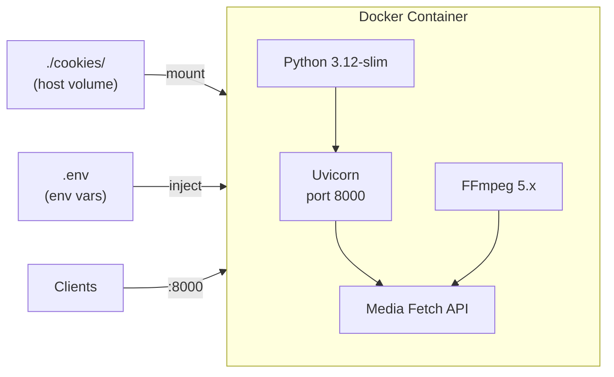

The `Dockerfile` uses `python:3.12-slim`, installs FFmpeg via `apt`, copies the app and runs Uvicorn. A health check pings `/api/health` every 30 seconds.

```bash
# Build
docker build -t media-fetch-api .

# Run with cookie volume
docker run -d \
  --name media-fetch-api \
  -p 8000:8000 \
  -v $(pwd)/cookies:/app/cookies \
  --restart unless-stopped \
  media-fetch-api

# Or use docker compose
docker compose up -d
```

### Systemd (Bare Metal)

```ini
[Unit]
Description=Media Fetch API
After=network.target

[Service]
Type=simple
User=www-data
WorkingDirectory=/opt/media-fetch-api
ExecStart=/opt/media-fetch-api/venv/bin/uvicorn app.main:app --host 0.0.0.0 --port 8000
Restart=always
RestartSec=5
EnvironmentFile=/opt/media-fetch-api/.env

[Install]
WantedBy=multi-user.target
```

### Behind a Reverse Proxy (Nginx)

```nginx
server {
    listen 80;
    server_name media-api.example.com;

    location / {
        proxy_pass http://127.0.0.1:8000;
        proxy_set_header Host $host;
        proxy_set_header X-Real-IP $remote_addr;
        proxy_set_header X-Forwarded-For $proxy_add_x_forwarded_for;
        proxy_set_header X-Forwarded-Proto $scheme;
        proxy_read_timeout 120s;
    }
}
```

---

## Development

### Prerequisites

- Python 3.12+
- FFmpeg (for audio conversion and stream probing)
- `pip` for dependency management

### Setup

```bash
# Create venv and install everything
python3 -m venv venv
source venv/bin/activate
pip install ".[dev]"

# Install pre-commit hooks
pre-commit install
```

### Dependencies

**Runtime** (`pyproject.toml` `[project.dependencies]`):

| Package | Purpose |
|---------|---------|
| `fastapi` | Web framework |
| `uvicorn[standard]` | ASGI server with HTTP/2, WebSocket |
| `httpx[http2]` | Async HTTP client with HTTP/2 |
| `pydantic` | Data validation and serialization |
| `pydantic-settings` | Settings from environment variables |
| `beautifulsoup4` | HTML parsing (fallback extractors) |
| `lxml` | Fast XML/HTML parser backend |
| `m3u8` | HLS playlist parsing utilities |
| `python-dotenv` | `.env` file loading |
| `pycryptodome` | Cryptographic primitives |

**Development** (`pyproject.toml` `[project.optional-dependencies.dev]`):

| Package | Purpose |
|---------|---------|
| `ruff` | Linter and formatter (replaces black, isort, flake8) |
| `pre-commit` | Git pre-commit hook framework |
| `pytest` | Test runner |
| `pytest-asyncio` | Async test support |

### Code Quality Tooling

All formatting, linting, and import sorting is handled by **ruff** via a single `pyproject.toml` config.

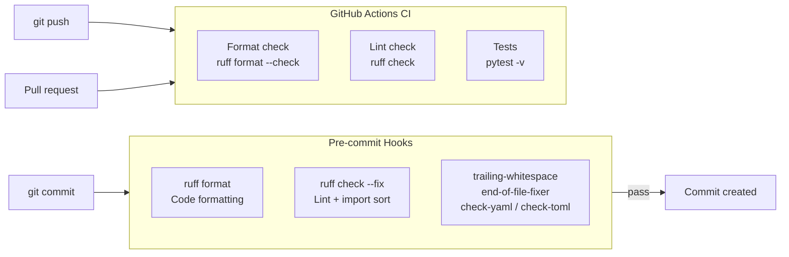

**Run manually:**

```bash
# Format all files
ruff format --config pyproject.toml .

# Lint and auto-fix
ruff check --fix --config pyproject.toml .

# Check without modifying (CI mode)
ruff format --check --config pyproject.toml .
ruff check --config pyproject.toml .
```

### Pre-commit Hooks

Hooks run automatically on every `git commit`. They are defined in `.pre-commit-config.yaml` and include:

| Hook | What It Does |
|------|-------------|
| `ruff-format` | Formats Python code (quotes, indentation, line length) |
| `ruff` | Lints for errors, unused imports, naming, and sorts imports |
| `trailing-whitespace` | Strips trailing whitespace from all files |
| `end-of-file-fixer` | Ensures files end with a newline |
| `check-yaml` / `check-toml` | Validates YAML and TOML syntax |
| `check-added-large-files` | Blocks files over 500 KB |
| `debug-statements` | Catches leftover `breakpoint()` / `pdb` calls |
| `check-merge-conflict` | Catches unresolved merge conflict markers |

To run all hooks on the entire codebase (not just staged files):

```bash
pre-commit run --all-files
```

### CI / GitHub Actions

The workflow at `.github/workflows/ci.yml` runs on:
- Every **push to `main`**
- Every **pull request targeting `main`**

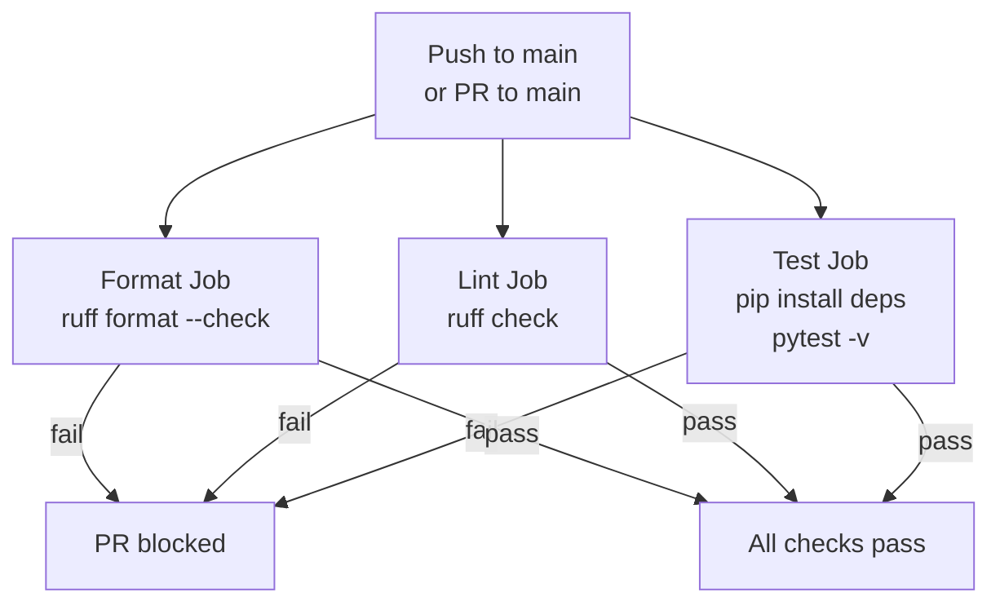

The three jobs run **in parallel**:

| Job | What It Checks | Fails If |
|-----|---------------|----------|
| **Format** | `ruff format --check` | Any file is not formatted |
| **Lint** | `ruff check` | Any lint error or unsorted import |
| **Test** | `pytest -v --tb=short` | Any test fails |

### Running Tests

Tests are in `tests/` and use **pytest**. The test suite covers:

| Test File | What It Tests | Tests |
|-----------|--------------|-------|
| `test_url_matcher.py` | URL patterns for all 12 platforms, aliases, short links, unsupported URLs | 48 |
| `test_models.py` | Enums, request/response models, validation, defaults | 16 |
| `test_ffmpeg.py` | Audio/video codec maps, enum-map parity, FFmpeg availability | 14 |
| `test_cookies.py` | Netscape parsing, corrupt files, expired cookies, runtime ops, reload | 16 |
| `test_helpers.py` | traverse_obj, int/float/str_or_none, URL helpers, format sorting, M3U8 | 26 |
| `test_http_client.py` | Retry config, backoff calculation, cookie storage, UA pool | 12 |
| `test_extractors.py` | Extractor factory, class names, error types | 4 |
| **Total** | | **154** |

```bash
# Run all tests
pytest -v

# Run a specific test file
pytest tests/test_url_matcher.py -v

# Run a specific test class
pytest tests/test_cookies.py::TestCorruptFiles -v

# Run with short traceback
pytest --tb=short

# Run in quiet mode (just dots)
pytest -q
```

### Adding a New Extractor

1. **Create** `app/extractors/<platform>.py`
2. **Inherit** from `BaseExtractor`
3. **Set** `platform = Platform.<PLATFORM>`
4. **Implement** `_extract()` returning an `ExtractResponse`
5. **Register** the extractor in `app/extractors/__init__.py` inside `_load_extractors()`
6. **Add URL patterns** to `app/core/url_matcher.py` in the `_PATTERNS` list
7. **Add the platform** to `app/models/enums.py` in the `Platform` enum
8. **Add tests** in `tests/test_url_matcher.py` for the new URL patterns

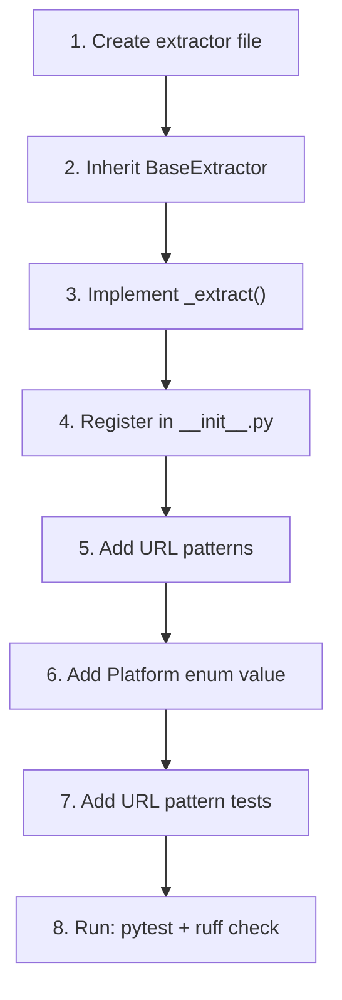

---

## Troubleshooting

| Problem | Cause | Solution |
|---------|-------|----------|
| `FFmpeg not found` | FFmpeg not installed | `sudo apt install ffmpeg` or set `FFMPEG_PATH` in `.env` |
| `Could not obtain SoundCloud client ID` | SoundCloud changed JS bundles | SoundCloud rotates client IDs; retry or wait |
| YouTube returns `LOGIN_REQUIRED` | Age-restricted content | Add YouTube cookies to `cookies/youtube.txt` |
| Instagram returns 401 | Private account or rate limit | Add Instagram cookies to `cookies/instagram.txt` |
| Reddit returns 403 | Rate limiting | Happens with high request volume; the API retries automatically |
| Twitter `guest_token` fails | API rate limit | Wait a few minutes and retry |
| `h2` package error | HTTP/2 dependency missing | `pip install httpx[http2]` |
| YouTube `signatureCipher` fails | Player JS changed | The JS interpreter may need updates for new cipher patterns |
| Vimeo `forbidden` | Password-protected video | Pass `"password": "..."` in the request body |
| Google Drive `not_media` | File is a document, not video/audio | Only video and audio MIME types are allowed |
